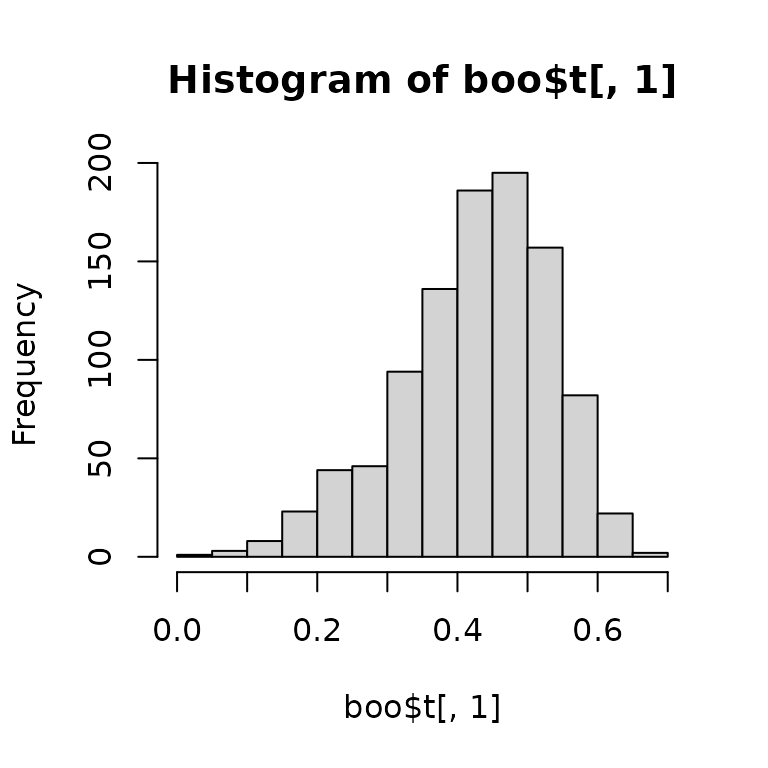
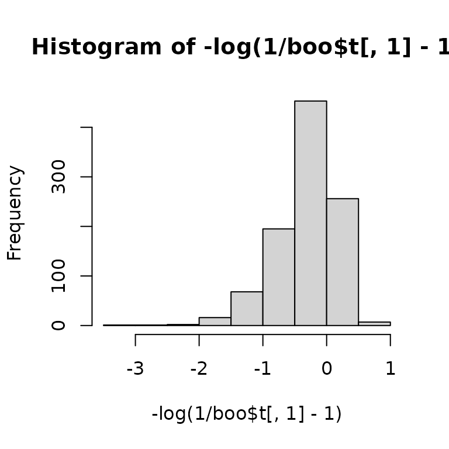

# Using Multilevel Bootstrap for Derived Quantities

## Data

Here I use a synthetic dataset (`pop_syn`) bundled with the package,
which mimics the structure of the example data in Hox (2010, p. 17). The
synthetic data was generated from parameters estimated from the original
*popular* dataset.

``` r

library(dplyr)
library(lme4)
library(boot)
library(bootmlm)
```

For the interest of time, I will select only 20 schools and a few
students in each school:

``` r

set.seed(85957)
pop_sub <- pop_syn |> filter(school %in% sample(unique(school), 20)) |>
  group_by(school) |> sample_frac(size = .25) |> ungroup()
```

To illustrate doing bootstrapping to obtain standard error (*SE*) and
confidence interval (CI) for the intraclass correlation (ICC) of the
variable `popular`, we first fit an intercept only model:

``` r

m0 <- lmer(popular ~ (1 | school), data = pop_sub)
summary(m0)
```

    ## Linear mixed model fit by REML ['lmerMod']
    ## Formula: popular ~ (1 | school)
    ##    Data: pop_sub
    ## 
    ## REML criterion at convergence: 300.2
    ## 
    ## Scaled residuals: 
    ##     Min      1Q  Median      3Q     Max 
    ## -2.2515 -0.7290  0.1010  0.6254  2.1197 
    ## 
    ## Random effects:
    ##  Groups   Name        Variance Std.Dev.
    ##  school   (Intercept) 0.6116   0.7820  
    ##  Residual             0.7181   0.8474  
    ## Number of obs: 106, groups:  school, 20
    ## 
    ## Fixed effects:
    ##             Estimate Std. Error t value
    ## (Intercept)   5.3679     0.1935   27.74

The intraclass correlation is defined as
``` math
\rho = \frac{\tau^2}{\tau^2 + \sigma^2} = \frac{1}{1 + \sigma^2 / \tau^2} 
  = \frac{1}{1 + \theta^{-2}},
```
where $`\theta = \tau / \sigma`$ is the relative cholesky factor for the
random intercept term used in `lme4`. Therefore, we can estimate the ICC
as:

``` r

(icc0 <- 1 / (1 + getME(m0, "theta")^(-2)))
```

    ## school.(Intercept) 
    ##          0.4599417

So the ICC is quite large for this data set. However, it is important to
also quantify the uncertainty of a point estimate. We can get the
asymptotic standard error (ASE) of the ICC using the *delta method*:

``` r

# Get the point estimate of theta:
th_est <- getME(m0, "theta")
# Get the variance of theta using the bootmlm::vcov_theta() function
th_var <- bootmlm::vcov_theta(m0)
# We can get the asymptotic variance of ICC using delta method with an 
# appropriate transformation. `x1` is the variable name needed for the first
# variable, which is theta in our case
icc_avar <- msm::deltamethod(g = ~ 1 / (1 + x1^(-2)), 
                            mean = th_est, cov = th_var, ses = FALSE)
```

So we can get an approximate symmetric CI with

``` r

icc0 + c(-2, 2) * sqrt(icc_avar)
```

    ## Warning in c(-2, 2) * sqrt(icc_avar): Recycling array of length 1 in vector-array arithmetic is deprecated.
    ##   Use c() or as.vector() instead.

    ## [1] 0.2436891 0.6761944

## Bootstrap-$`t`$ CI

``` r

icc <- function(x) {
  th_est <- x@theta
  est <- 1 / (1 + th_est^(-2))
  th_var <- vcov_theta(x)
  var <- msm::deltamethod(g = ~ 1 / (1 + x1^(-2)), 
                            mean = th_est, cov = th_var, ses = FALSE)
  c(est, var)
}
icc(m0)
```

    ## [1] 0.4599417 0.0116913

``` r

# These heavy computations are not run live on CRAN, but you can run them locally.
boo <- bootstrap_mer(m0, icc, 999L, type = "case")

# Influence values for BCa
inf_val <- empinf_mer(m0, icc, index = 1)
```

``` r

# boo and inf_val are pre-loaded in this vignette
boot::boot.ci(boo, L = inf_val)
```

    ## BOOTSTRAP CONFIDENCE INTERVAL CALCULATIONS
    ## Based on 999 bootstrap replicates
    ## 
    ## CALL : 
    ## boot::boot.ci(boot.out = boo, L = inf_val)
    ## 
    ## Intervals : 
    ## Level      Normal              Basic             Studentized     
    ## 95%   ( 0.2848,  0.7027 )   ( 0.3200,  0.7277 )   ( 0.3036,  0.7531 )  
    ## 
    ## Level     Percentile            BCa          
    ## 95%   ( 0.1922,  0.5999 )   ( 0.2537,  0.6319 )  
    ## Calculations and Intervals on Original Scale
    ## Some BCa intervals may be unstable

## On a Transformed Scale

Because ICC is bounded between $`-1`$ and 1, and commonly between 0 and
1, a potentially better approach to construct a confidence interval for
ICC is to first transform it so that the sampling distribution is closer
to normal. As stated in Ukoumunne, Davison, Gulliford, and Chinn (2003),
one can use apply a transformation:
``` math
h(t) = \log(\frac{\hat \rho}{1 - \hat \rho})
```

You can compare the distribution before and after transformation:

``` r

hist(boo$t[ , 1])
```



``` r

hist(-log(1 / boo$t[ , 1] - 1))
```



One can obtain the CI on the transformed scale, and then scale it back
to the original ICC scale:

``` r

boot::boot.ci(boo, L = inf_val, h = qlogis, 
              hdot = function(x) 1 / (x - x^2), 
              hinv = plogis)
```

    ## BOOTSTRAP CONFIDENCE INTERVAL CALCULATIONS
    ## Based on 999 bootstrap replicates
    ## 
    ## CALL : 
    ## boot::boot.ci(boot.out = boo, L = inf_val, h = qlogis, hdot = function(x) 1/(x - 
    ##     x^2), hinv = plogis)
    ## 
    ## Intervals : 
    ## Level      Normal              Basic             Studentized     
    ## 95%   ( 0.2791,  0.7209 )   ( 0.3260,  0.7530 )   ( 0.3163,  0.6692 )  
    ## 
    ## Level     Percentile            BCa          
    ## 95%   ( 0.1922,  0.5999 )   ( 0.2537,  0.6319 )  
    ## Calculations on Transformed Scale;  Intervals on Original Scale
    ## Some BCa intervals may be unstable

Note: Percentile and BCa intervals are invariant to 1-1 transformation.
